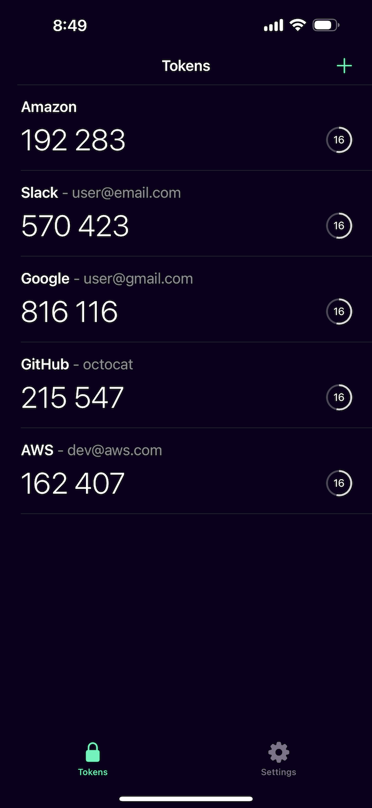
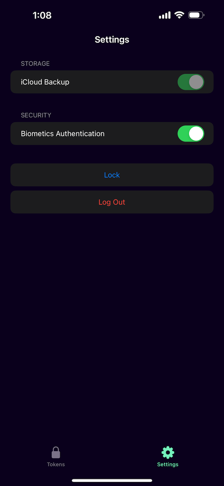
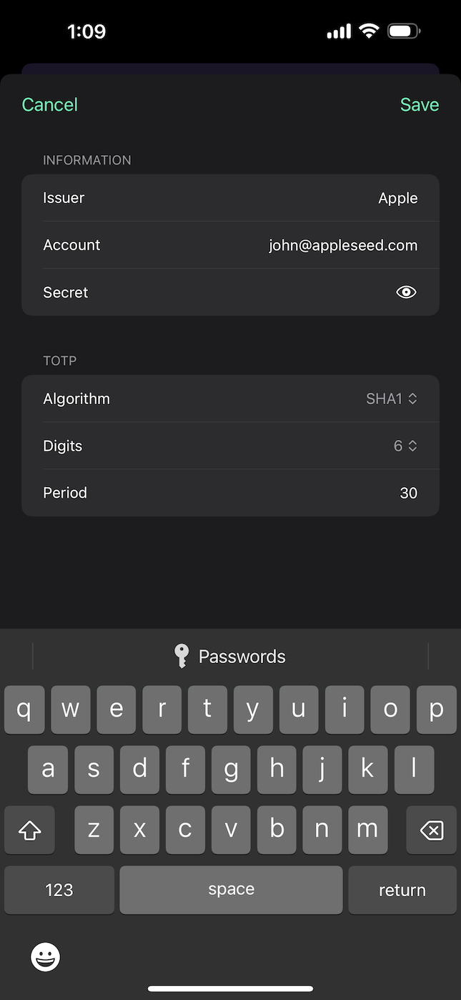

# Chronos

  

Chronos is an open-source two-factor authentication (2FA) app for iOS, developed natively in SwiftUI. It aims to provide robust security and reliable backup features, supporting both time-based (TOTP) and counter-based (HOTP) authentication methods.

  

## Features

- End-to-end encrypted (E2EE)
    - Token data are encrypted using XChaCha20-Poly1305
- Secure decryption methods:
  - Password (derived with scrypt)
  - Face ID (via Secure Enclave)
- Automatic backup & sync to Apple iCloud (optional)
- Export (Coming Soon)
    - Plain text or encrypted
    - HTML with QR codes for easy scanning
- Built natively with Swift

## Screenshots (Preview)

## License

This project is licensed under the GNU Affero General Public License v3.0 - see the [LICENSE](LICENSE) file for details.
